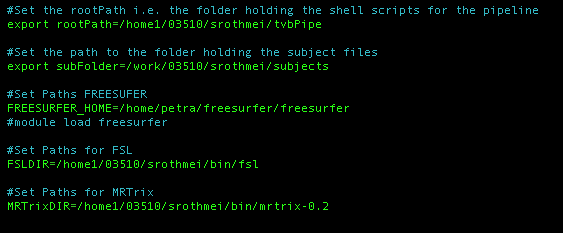
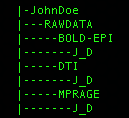
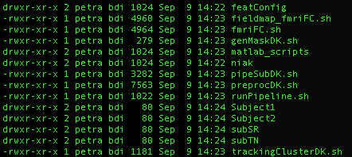
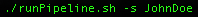
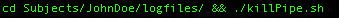
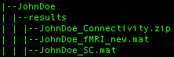

<h1>Empirical processing pipeline for The Virtual Brain</h1>
=============================================================================
Constructing subject specific virtual brains

Developers: Michael Schirner, Simon Rothmeier, Petra Ritter 
BrainModes Research Group (head: P. Ritter) 
Charité University Medicine Berlin & Max Planck Institute Leipzig, Germany 
Correspondence: petra.ritter@charite.de 
 
When using this code please cite as follows: 
Schirner, M., Rothmeier, S., Jirsa, V. K., McIntosh, A. R., & Ritter, P. (2015).  
An automated pipeline for constructing personalized virtual brains from multimodal neuroimaging data. NeuroImage. 
Used software packages:
=============================================================================
<ul>
<li>FREESURFER (https://surfer.nmr.mgh.harvard.edu)</li>
<li>FSL (http://fsl.fmrib.ox.ac.uk/fsl/fslwiki/)</li>
<li>MRTrix (http://www.brain.org.au/software/)</li>
<li>GNU Octave (http://www.gnu.org/software/octave/)</li>
<li>NIAK (Neuroimaging Analysis Kit; MATLAB toolbox) (https://www.nitrc.org/projects/niak/)</li>
</ul>
=============================================================================
<h2>WARNING:</h2>
The diffusion processing in MRTrix currently only features the handling of <b>single shell</b> dwMRI data, i.e. recordings using the same b-value (this currently hold for the versions 0.2 as used by us and also version 3 of MRTrix). 
If you intend to process multi-shell dwMRI data, please take a look at the multi-shell-branch of this pipeline which uses Camino (http://cmic.cs.ucl.ac.uk/camino/) to perform fiber tracking (work in progress).
How to use the pipeline:
=============================================================================
 IMPORTANT: The pipeline is designed to work on a high performance cluster using the SLURM job scheduler. Hence all commands
in the scripts for submitting computational jobs must be replaced when using a different scheduling system! 
Also the required software packages (FREESURFER, FSL and MRTrix) have to be installed or the executables have to be placed inside a folder accessable for the executing user. 
GNU Octave has to be installed system-wide and executable for the job scheduler.
<ol>
<li><b>Setup:</b></li>
After extracting the files on your machine (e.g. after donwloading&unpacking or cloning the repository directly from Github), you first need to adapt some parameters to your local paths. 
All these settings are located within the <b>pipeSetup.sh</b> script. Open it using your favorite command line editor like nano or vim: 
 
Note that in the picture above, FREESURFER is also installed on the HPC as a module and can thus be simply loaded as a module instead of setting it up manually. 

<li><b>Data structure:</b> 
 
First, make sure that the data structure inside your subject folder looks exactly like displayed in the picture above.
This means that inside your actual subject folder, there must be a folder named "RAWDATA", containing the different
MR images recorded by using the three different imaging modalities (anatomical, DTI, fMRI).Having fMRI images is optional, meaning you can run the pipeline using only anatomical and diffusion data which will then create just the structural connectivity and not the functional connectivity matrix. 
The DICOM files produced by your MR-scanner thus have to be placed in their according subfolders.
</li>
<li><b>Initialize the scripts:</b> 
All the scripts found in this repository must be placed in the same folder on the cluster. The subject folders
can be placed in another folder for the sake of a clear structure. The resulting folder structure should look like follows: 
 
</li>
<li><b>Process a specific subject:</b> 
To tun the pipeline using the dataset for a specific subject, simply execute the following:
 
The pipeline will now run fully automated as a background process. This process will initialize the SLURM job-chain. 
Log-files for the different steps are placed within the subject-folder. Using those files it is possible to monitor how far the
execution of the pipeline has already progressed. 
To abort the whole pipeline, simply execute the script <b>killPipe.sh</b> from within the logfiles-folder. This script will send the scancel-command to all jobs belonging to the subjects pipeline run. 
 
The approximated runtime for the pipeline (depending on how much cores are available at launch time) is around 24h per subject.
</li>
<li><b>Check the results:</b> 
The resulting SC/FC matrices are placed in the results folder: 
 
Besides the SC and FC matrices in MATLAB/Octave .mat-format, the pipeline also generated a .zip-file containing a ready-to-import TVB connectivity-dataset for the subject. 
 
The NSG branch of the pipeline also finalizes the subject-folder by removing the sizeable track-files of MRTrix (.tck) and compressing the folder into a single .tar.gz-file 
The tar-archive will be of a size less than 2GB per subject.
</li>
</ol>
