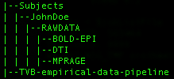

Empirical processing pipeline for The Virtual Brain
=============================================================================
Constructing subject specific virtual brains

Developers: Michael Schirner, Simon Rothmeier, Petra Ritter 
BrainModes Research Group (head: P. Ritter) 
Charité University Medicine Berlin & Max Planck Institute Leipzig, Germany 
Correspondence: petra.ritter@charite.de 
 
When using this code please cite as follows: 
Schirner M, Rothmeier S, Jirsa V, McIntosh AR, Ritter P (in prep) 
Constructing subject-specific Virtual Brains from multimodal neuroimaging 
Used software packages:
=============================================================================
<ul>
<li>FREESURFER (https://surfer.nmr.mgh.harvard.edu)</li>
<li>FSL (http://fsl.fmrib.ox.ac.uk/fsl/fslwiki/)</li>
<li>MRTrix (http://www.brain.org.au/software/)</li>
<li>GNU Octave (http://www.gnu.org/software/octave/)</li>
<li>NIAK (Neuroimaging Analysis Kit; MATLAB toolbox) (https://code.google.com/p/niak/)</li>
</ul>
How to use the pipeline:
=============================================================================
 IMPORTANT: The pipeline is designed to work on a high performance cluster using the OAR job scheduler. Hence all commands 
in the scripts fore submitting computational jobs must be replaced when using a different scheduling system! 
Also the required software packages (FREESURFER, FSL and MRTrix) have to be installed or the executables have to be placed inside a folder accessable for the executing user. 
GNU Octave has to be installed system-wide and executable for the job scheduler.
<ol>
<li><b>Data structure:</b> 
 
First, make sure that the data structure inside your subject folder looks exactly like displayed in the picture above.
This means that inside your actual subject folder, there must be a folder named "RAWDATA", containing the different
MR images recorded by using the three different imaging modalities (anatomical, DTI, fMRI). 
Inside each of these folders, there should be a subfolder named according to the abbreviation of your subject ID containing the first letters of the forename and the first one of the family name (e.g. for the subject-ID
JohnDoe, the abbreviation would be J_D). Note that this is not mandatory i.e. you can choose whatever abbreviation wanted as long as the chosen schema is kept consistently throughout the whole RAWDATA folders. 
The DICOM files produced by your MR-scanner thus have to be placed in their according abbreviation-subfolders.
</li>
<li><b>Initialize the scripts:</b> 
All the scripts found in this repository must be placed in the same folder on the cluster. Currently, also the subject folders
have to be placed in this pipeline-folder. The resulting folder structure should look like follows: 
 
After this is done, open the script <b style="color:red;">pipeSetup.sh</b> and edit the paths in the file accordingly to your setup
(e.g. by using a text editor inside the terminal like nano).
</li>
<li><b>Process a specific subject:</b> 
To tun the pipeline using the dataset for a specific subject, simply execute the following:

./runPipeline.sh -s JohnDoe -a J_D

The pipeline will now run fully automated as a background process. A .log-file is placed in the folder. Using this file it is possible to monitor how far the 
execution of the pipeline has already progressed. Furthermore the process ID (PID) is displayed in this file which can be used to kill 
the background process in case something went wrong. 
The approximated runtime for the pipeline (depending on how much cores are available at launch time) is around 16h per subject.
</li>
<li><b>Check the results:</b> 
The resulting SC matrices are placed in the folder:

/home/yourUserName/pipeline/JohnDoe/mrtrix_68/tracks_68/JD_SC.mat

The FC matrix is placed in the folder

/home/yourUserName/pipeline/JohnDoe/bold/JD_fMRI_new.mat

</li>
</ol>
